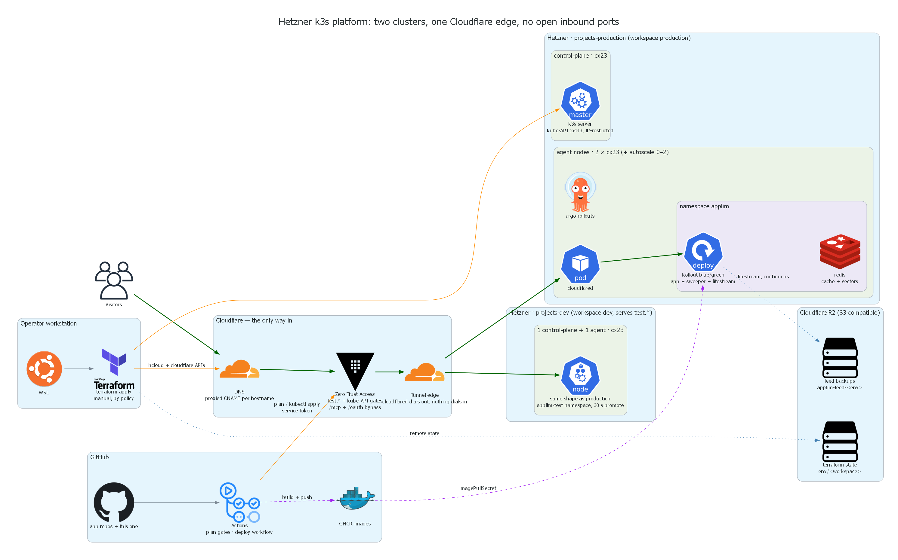
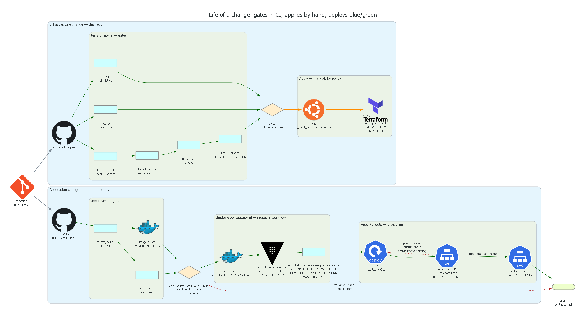

# Hetzner Kubernetes platform

Terraform for two k3s clusters on Hetzner Cloud, built with
[kube-hetzner](https://github.com/kube-hetzner/terraform-hcloud-kube-hetzner) and
fronted entirely by Cloudflare. One cluster per Terraform workspace; ingress is a
Cloudflare Tunnel, so nothing listens on a public port and there is no load
balancer and no certificate to manage. Applications live in their own
repositories and deploy themselves through a reusable GitHub Actions workflow
kept here; this repository owns the clusters, the edge, the state backend and
the deploy contract. CI plans every change, but nobody applies from CI — applies
are run by hand from WSL, on purpose.

| Workspace | Cluster | Serves | Shape | Approx. cost |
|---|---|---|---|---|
| `dev` | `projects-dev` | `test.*` hostnames | 1x cx23 control plane (schedulable) + 1x cx23 agent | ~€10/mo |
| `production` | `projects-production` | production hostnames | 1x cx23 control plane + 2x cx23 agents + autoscaler (0–2) | ~€20–30/mo |

`default` maps to production, so an unselected workspace cannot land in a
half-configured environment.

## How a request flows

1. A visitor resolves `applim.com`. Cloudflare DNS holds a **proxied CNAME** to
   `<tunnel-id>.cfargotunnel.com`, so the request lands on Cloudflare's edge.
2. The edge terminates TLS and applies WAF and proxy rules. For an operator
   hostname — every `test.*` name, and `preview.*` in production — **Zero Trust
   Access** challenges first: an e-mail one-time PIN for people, a service token
   for CI. Four paths on the applim test site (`/mcp`, `/oauth`, and the two
   OAuth `.well-known` documents) carry a bypass policy, because claude.ai's
   connector servers cannot answer an Access challenge and the application
   authenticates them itself.
3. The edge hands the request to the tunnel. There is no inbound connection: the
   `cloudflared` pod in the cluster dialled *out* over QUIC (UDP 7844, TCP
   fallback), and the request travels back down that connection.
4. `cloudflared` routes by hostname to a cluster-internal Service —
   `applim.applim.svc.cluster.local:80` in production, `applim-test.applim-test…`
   on dev — which fronts the Argo Rollout's pods.
5. The kube-API rides the same tunnel as a TCP service on
   `k8s.piergiorgioyankah.com` / `k8s-dev.piergiorgioyankah.com`, gated by
   Access. Direct access to port 6443 and to SSH is limited by the Hetzner
   firewall to the CIDRs in `firewall_kube_api_source` / `firewall_ssh_source`.

The only Hetzner firewall openings are those two operator CIDRs and outbound
7844. Nothing else is reachable from the internet.

## CI/CD

A change to this repository runs `terraform fmt -check`, `terraform validate`,
Checkov and a full-history gitleaks scan on every push and pull request; with
the CI secrets configured and the `TERRAFORM_PLAN_ENABLED` repository variable
set to `true` it also runs a real `terraform plan` against the R2 state — the
`dev` workspace always, `production` additionally on anything aimed at `main`.
The plan reaches the kube-API through the same Access-gated tunnel a deploy
uses. It never applies: after review and merge, a person runs the apply from
WSL. A change to an application repository runs that repository's own gates
(format/build/unit, browser end-to-end, an image smoke test) and then calls
[deploy-application.yml](.github/workflows/deploy-application.yml), which builds
and pushes the image to GHCR, opens the Access tunnel, renders
`kubernetes/application.yaml` with `envsubst` and applies it, then waits out the
blue/green preview window while the new version serves only on the
Access-gated `preview.<hostname>`. Failing probes abort the rollout, fail the
job, and leave the stable version serving.

`envsubst` is given an explicit allowlist of six variables — `APP_NAME`,
`REPLICAS`, `IMAGE`, `PORT`, `HEALTH_PATH`, `PROMOTE_SECONDS` — so any other `$`
in the manifest (container args, Kubernetes' own `$(VAR)` expansion) passes
through untouched.

`actions/checkout` inside a reusable workflow checks out the **calling**
repository, so `kubernetes/application.yaml` is read from the application's own
tree. The copy here is the template to start from: an app that needs more than
one container — a redis, a litestream sidecar — extends its own copy.

## Repository layout

A thin root composing two local modules, split by blast radius and rate of
change rather than by provider. Provider configuration stays in the root and the
child modules inherit it, so neither can be applied on its own; the split buys a
readable plan and a clear blast radius, not independent state.

| Path | What it is |
|---|---|
| [versions.tf](versions.tf) | `required_version`, provider constraints, the R2 backend, provider configuration |
| [main.tf](main.tf) | environment locals (`terraform.workspace` → `local.environment`) and the two module calls |
| [variables.tf](variables.tf) | every input, typed, described and validated |
| [outputs.tf](outputs.tf) | kubeconfig, cluster name, kube-API hostname, the CI Access token pair |
| [services.tf](services.tf) | the site map (hostname per app per environment) and the per-app env Secret |
| [rollouts.tf](rollouts.tf) | the `argo-rollouts` namespace and Helm release |
| [backups.tf](backups.tf) | the per-workspace R2 bucket and scoped token litestream replicates the applim feed to |
| [modules/cluster/](modules/cluster) | the kube-hetzner cluster: nodepools, network, Hetzner firewall. Touching it recycles nodes |
| [modules/cluster/main.tf](modules/cluster/main.tf) | the pinned `kube-hetzner/kube-hetzner/hcloud` module call and the firewall rules |
| [modules/cluster/variables.tf](modules/cluster/variables.tf) | sizing and firewall inputs |
| [modules/cluster/outputs.tf](modules/cluster/outputs.tf) | kubeconfig, and the split-out host/cert form the providers need |
| [modules/edge/](modules/edge) | everything Cloudflare, plus the one pod that dials out to it. Changes on every routing change |
| [modules/edge/main.tf](modules/edge/main.tf) | tunnel, tunnel config, DNS records, Access applications and policies, the `cloudflared` Deployment |
| [modules/edge/variables.tf](modules/edge/variables.tf) | account, zones, sites, environment flags |
| [modules/edge/outputs.tf](modules/edge/outputs.tf) | kube-API hostname and the CI Access service token |
| [bootstrap/main.tf](bootstrap/main.tf) | the R2 state bucket and its scoped token. Local state, run once, never again |
| [bootstrap/.terraform.lock.hcl](bootstrap/.terraform.lock.hcl) | bootstrap's provider lock, committed like the root one |
| [kubernetes/application.yaml](kubernetes/application.yaml) | not Terraform: the `envsubst` deploy manifest template (Namespace, active + preview Service, Rollout) |
| [.github/workflows/terraform.yml](.github/workflows/terraform.yml) | this repository's CI: fmt/validate, Checkov, gitleaks, real plans |
| [.github/workflows/deploy-application.yml](.github/workflows/deploy-application.yml) | the reusable workflow application repositories call to deploy |
| [.checkov.yaml](.checkov.yaml) | Checkov scope and the three skip-checks, each with its reason |
| [.gitleaks.toml](.gitleaks.toml) | secret-scanning config: default rules plus two reviewed allowlists |
| [.terraform.lock.hcl](.terraform.lock.hcl) | exact provider versions, committed |
| [.gitignore](.gitignore) | what never enters the repository — see the secrets model below |
| [docs/diagrams/architecture.py](docs/diagrams/architecture.py) | generates `architecture.png` (mingrammer `diagrams` + Graphviz) |
| [docs/diagrams/cicd.py](docs/diagrams/cicd.py) | generates `cicd.png` |
| `docs/diagrams/*.png` | the rendered diagrams above, committed so the README works without a toolchain |
| [terraform.tfvars.example](terraform.tfvars.example) | the shape of the local-only `terraform.tfvars` |
| [backend.hcl.example](backend.hcl.example) | the shape of the local-only `backend.hcl`, if you ever fill it by hand |

Regenerate a diagram with `pip install diagrams` (Graphviz's `dot` must be on
PATH) and `python docs/diagrams/architecture.py`. Both scripts write next to
themselves, so the working directory does not matter.

### Conventions

- **Environments are workspaces, not directories.** `terraform.workspace` drives
  `local.environment`, and every name derives from `local.full_cluster_name`
  (`<cluster_name>-<environment>`), so the two clusters never collide in Hetzner
  or Cloudflare. State is isolated per workspace at `env/<workspace>/` in R2. The
  two environments are the *same* infrastructure with different sizing, so a
  directory per environment would only duplicate the configuration.
- **Everything is pinned.** `required_version` is bounded, provider constraints
  live in `versions.tf` with exact versions in the committed
  `.terraform.lock.hcl`, the `kube-hetzner` registry module is pinned to an exact
  version because a minor bump rebuilds nodes, and Helm charts and container
  images carry explicit versions.
- **Variables are typed, described, and validated** where a bad value would
  otherwise fail deep inside a provider call.
- **Nothing public by default.** No inbound ports; ingress is an outbound-only
  tunnel and every operator-facing hostname sits behind Cloudflare Access.
- **CI plans, people apply.** Nothing in this repository can change
  infrastructure without a human running the apply.

## Operating it

First-time setup, the secrets model and the runbooks live in
[docs/OPERATIONS.md](docs/OPERATIONS.md). The short version: state in R2,
secrets only in `terraform.tfvars`/`backend.hcl` (gitignored) and GitHub
Actions secrets, plans in CI, applies by hand from WSL.
