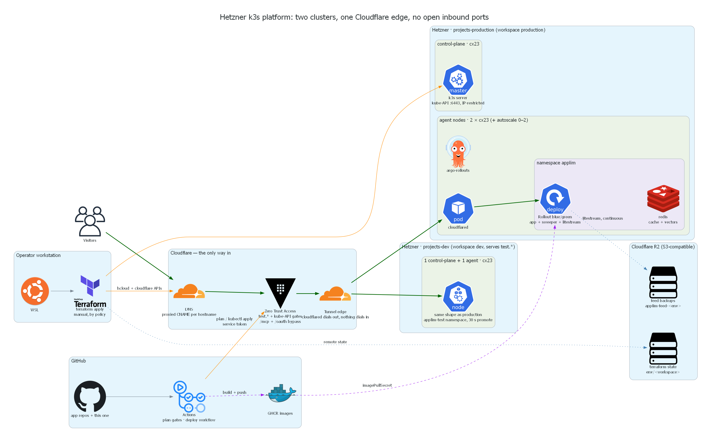
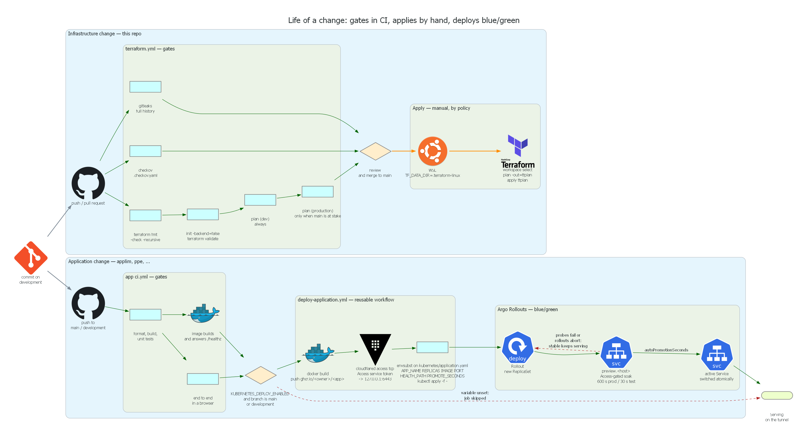

# Hetzner Kubernetes platform

Terraform for two k3s clusters on Hetzner Cloud, built with
[kube-hetzner](https://github.com/kube-hetzner/terraform-hcloud-kube-hetzner) and
fronted entirely by Cloudflare. One cluster per Terraform workspace; ingress is a
Cloudflare Tunnel, so nothing listens on a public port and there is no load
balancer and no certificate to manage. Applications live in their own
repositories and deploy themselves through a reusable GitHub Actions workflow
kept here; this repository owns the clusters, the edge, the state backend and
the deploy contract. CI plans every change, but nobody applies from CI — applies
are run by hand from WSL, on purpose.

| Workspace | Cluster | Serves | Shape | Approx. cost |
|---|---|---|---|---|
| `dev` | `projects-dev` | `test.*` hostnames | 1x cx23 control plane (schedulable) + 1x cx23 agent | ~€10/mo |
| `production` | `projects-production` | production hostnames | 1x cx23 control plane + 2x cx23 agents + autoscaler (0–2) | ~€20–30/mo |

Each environment lives in its **own Hetzner project** with its own API token,
because kube-hetzner stores that token inside the cluster: a dev compromise must
not reach production servers. `default` is not an environment: Terraform
refuses to plan in it, so a forgotten `workspace select` fails instead of
planning a second production on an empty state.

## How a request flows

1. A visitor resolves `applim.com`. Cloudflare DNS holds a **proxied CNAME** to
   `<tunnel-id>.cfargotunnel.com`, so the request lands on Cloudflare's edge.
2. The edge terminates TLS and applies the zone rules kept in
   [modules/edge](modules/edge): TLS 1.2 minimum, HTTPS only, a per-IP rate
   limit on `/oauth*`, and URL normalization that forwards to the origin the same
   URL Access and the WAF matched. For an operator hostname — every `test.*`
   name, and `preview.*` in production — **Zero Trust Access** challenges first:
   an e-mail one-time PIN for people, a service token for CI. Four paths on the
   applim test site (`/mcp`, `/oauth`, and the two OAuth `.well-known` documents)
   bypass Access for Anthropic's published outbound range only
   (`mcp_client_cidrs`), because claude.ai's connector servers cannot answer an
   Access challenge and the application authenticates them itself; anyone else
   on those paths gets the PIN.
3. The edge hands the request to the tunnel. There is no inbound connection: the
   `cloudflared` pod in the cluster dialled *out* over QUIC (UDP 7844, TCP
   fallback), and the request travels back down that connection.
4. `cloudflared` routes by hostname to a cluster-internal Service —
   `applim.applim.svc.cluster.local:80` in production, `applim-test.applim-test…`
   on dev — which fronts the Argo Rollout's pods. A NetworkPolicy lets an app's
   pods be reached only from `cloudflared` and from their own namespace, so the
   edge is not the only thing standing in front of them.
5. The kube-API rides the same tunnel as a TCP service on
   `k8s.piergiorgioyankah.com` / `k8s-dev.piergiorgioyankah.com`, gated by
   Access. Direct access to port 6443 and to SSH is limited by the Hetzner
   firewall to the CIDRs in `firewall_kube_api_source` / `firewall_ssh_source`.

Inbound, the Hetzner firewall opens only those two operator CIDRs (never `/0`:
the variables reject it). Outbound it allows kube-hetzner's defaults (DNS,
HTTP/HTTPS, NTP, ICMP) plus 7844 to Cloudflare's published tunnel ranges. The
hcloud cloud controller is told not to create load balancers, so no Service can
open a public entry that bypasses Cloudflare. Nothing else is reachable from the
internet.

## CI/CD

A change to this repository runs `terraform fmt -check`, `terraform validate`,
Checkov and a full-history gitleaks scan on every push and pull request; with
the CI secrets configured and the `TERRAFORM_PLAN_ENABLED` repository variable
set to `true` it also runs a real `terraform plan` against the R2 state — the
`dev` workspace always, `production` additionally on anything aimed at `main`.
The plan reaches the kube-API through the same Access-gated tunnel a deploy
uses. It never applies: after review and merge, a person runs the apply from
WSL. A change to an application repository runs that repository's own gates
(format/build/unit, browser end-to-end, an image smoke test) and then calls
[deploy-application.yml](.github/workflows/deploy-application.yml), which builds
and pushes the image to GHCR, opens the Access tunnel with that app's own
service token, renders `kubernetes/application.yaml` with `envsubst` and applies
it as the app's namespaced `deployer` (never cluster-admin), then waits out the
blue/green preview window while the new version serves only on the
Access-gated `preview.<hostname>`. Failing probes abort the rollout, fail the
job, and leave the stable version serving.

`envsubst` is given an explicit allowlist of six variables — `APP_NAME`,
`REPLICAS`, `IMAGE`, `PORT`, `HEALTH_PATH`, `PROMOTE_SECONDS` — so any other `$`
in the manifest (container args, Kubernetes' own `$(VAR)` expansion) passes
through untouched.

`actions/checkout` inside a reusable workflow checks out the **calling**
repository, so `kubernetes/application.yaml` is read from the application's own
tree. The copy here is the template to start from: an app that needs more than
one container — a redis, a litestream sidecar — extends its own copy. Whatever
the copy says, it can only land inside the app's namespace, which Terraform
creates with Pod Security `baseline` enforced and `restricted` warned.

Every third-party piece of CI is pinned: actions by commit SHA (Dependabot
proposes bumps), `cloudflared` and `kubectl-argo-rollouts` by version plus
SHA-256, and a production deploy refuses to run from an unprotected branch. The
plan job's state token is read-only; plans never lock or write state.

## Repository layout

A thin root composing two local modules, split by blast radius and rate of
change rather than by provider. Provider configuration stays in the root and the
child modules inherit it, so neither can be applied on its own; the split buys a
readable plan and a clear blast radius, not independent state.

| Path | What it is |
|---|---|
| [versions.tf](versions.tf) | `required_version`, provider constraints, the R2 backend, provider configuration |
| [main.tf](main.tf) | environment locals (`terraform.workspace` → `local.environment`) and the two module calls |
| [variables.tf](variables.tf) | every input, typed, described and validated |
| [outputs.tf](outputs.tf) | operator kubeconfig, per-app deployer kubeconfigs, cluster name, kube-API hostname, per-consumer CI Access tokens |
| [services.tf](services.tf) | per-app namespace (Pod Security labels), namespaced `deployer` and its token, NetworkPolicy, and the applim env Secret |
| [rollouts.tf](rollouts.tf) | the `argo-rollouts` namespace and Helm release |
| [backups.tf](backups.tf) | the per-workspace R2 bucket and scoped token litestream replicates the applim feed to |
| [modules/cluster/](modules/cluster) | the kube-hetzner cluster: nodepools, network, Hetzner firewall. Touching it recycles nodes |
| [modules/cluster/main.tf](modules/cluster/main.tf) | the commit-pinned kube-hetzner module call, the firewall rules, and the no-load-balancer CCM setting |
| [modules/cluster/variables.tf](modules/cluster/variables.tf) | sizing and firewall inputs |
| [modules/cluster/outputs.tf](modules/cluster/outputs.tf) | kubeconfig, and the split-out host/cert form the providers need |
| [modules/edge/](modules/edge) | everything Cloudflare, plus the one pod that dials out to it. Changes on every routing change |
| [modules/edge/main.tf](modules/edge/main.tf) | tunnel, tunnel config, DNS records, Access applications and policies, the `cloudflared` Deployment, and the zone rules (rate limit, URL normalization, TLS settings) |
| [modules/edge/variables.tf](modules/edge/variables.tf) | account, zones, sites, environment flags |
| [modules/edge/outputs.tf](modules/edge/outputs.tf) | kube-API hostname and the CI Access service tokens |
| [bootstrap/main.tf](bootstrap/main.tf) | the R2 state bucket, its read/write token (operator) and read-only token (CI). Local state, run once, never again |
| [bootstrap/.terraform.lock.hcl](bootstrap/.terraform.lock.hcl) | bootstrap's provider lock, committed like the root one |
| [kubernetes/application.yaml](kubernetes/application.yaml) | not Terraform: the `envsubst` deploy manifest template (active + preview Service, Rollout); the namespace is Terraform's |
| [.github/workflows/terraform.yml](.github/workflows/terraform.yml) | this repository's CI: fmt/validate, Checkov, gitleaks, real plans |
| [.github/workflows/deploy-application.yml](.github/workflows/deploy-application.yml) | the reusable workflow application repositories call to deploy |
| [.checkov.yaml](.checkov.yaml) | Checkov scope and the one skip-check, with its reason |
| [.github/dependabot.yml](.github/dependabot.yml) | weekly bumps for the SHA-pinned actions |
| [.gitleaks.toml](.gitleaks.toml) | secret-scanning config: default rules plus two reviewed allowlists |
| [.terraform.lock.hcl](.terraform.lock.hcl) | exact provider versions, committed |
| [.gitignore](.gitignore) | what never enters the repository — see the secrets model below |
| [docs/diagrams/architecture.py](docs/diagrams/architecture.py) | generates `architecture.png` (mingrammer `diagrams` + Graphviz) |
| [docs/diagrams/cicd.py](docs/diagrams/cicd.py) | generates `cicd.png` |
| `docs/diagrams/*.png` | the rendered diagrams above, committed so the README works without a toolchain |
| [terraform.tfvars.example](terraform.tfvars.example) | the shape of the local-only `terraform.tfvars` |
| [backend.hcl.example](backend.hcl.example) | the shape of the local-only `backend.hcl`, if you ever fill it by hand |

Regenerate a diagram with `pip install diagrams` (Graphviz's `dot` must be on
PATH) and `python docs/diagrams/architecture.py`. Both scripts write next to
themselves, so the working directory does not matter.

### Conventions

- **Environments are workspaces, not directories.** `terraform.workspace` drives
  `local.environment`, and every name derives from `local.full_cluster_name`
  (`<cluster_name>-<environment>`), so the two clusters never collide in Hetzner
  or Cloudflare. State is isolated per workspace at `env/<workspace>/` in R2. The
  two environments are the *same* infrastructure with different sizing, so a
  directory per environment would only duplicate the configuration.
- **Everything is pinned.** `required_version` is bounded, provider constraints
  live in `versions.tf` with exact versions in the committed
  `.terraform.lock.hcl`, the `kube-hetzner` module is pinned to a commit
  because a bump rebuilds nodes and a registry tag can move, Helm charts carry
  explicit versions, container images a tag plus digest, actions a commit SHA,
  and downloaded binaries a version plus SHA-256.
- **Variables are typed, described, and validated** where a bad value would
  otherwise fail deep inside a provider call.
- **Nothing public by default.** No inbound ports and no load balancers;
  ingress is an outbound-only tunnel and every operator-facing hostname sits
  behind Cloudflare Access.
- **No repository holds cluster-admin.** App repositories deploy as a
  namespaced `deployer`; the admin kubeconfig stays with the operator.
- **CI plans, people apply.** Nothing in this repository can change
  infrastructure without a human running the apply.

## Operating it

First-time setup, the secrets model and the runbooks live in
[docs/OPERATIONS.md](docs/OPERATIONS.md). The short version: state in R2,
secrets only in `terraform.tfvars`/`backend*.hcl` (gitignored) and GitHub
Actions environment secrets, plans in CI, applies by hand from WSL.
